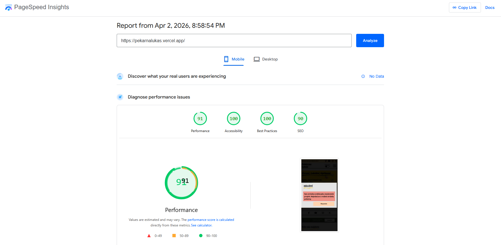

# Final project for TPW course

A semester-long project for TPW course: a responsive website for a fictional bakery

## Structure

The website consists of four pages:

* **Landing page** - Designed to catch the users attention, has call to action buttons and social media links

* **Product page** - Features products from a fictional bakery, allows filtering by product name

* **Career** - Displays fictional job offers, users can filter offers by name

* **Contact** - Simple contact page displaying contact information, opening hours, delivery details and featuring a contact form

## Used technologies

* **HTML5** - Semantic markup
* **CSS3** - Flexbox, grid, CSS variables
* **JavaScript** - Light/Dark mode switch, mobile menu, filtering products, generating product cards, link styling

## Key attributes

* **Responsivness** - Fully responsive design implemented using media queries

* **Accessibility** - Page has aria attributes, right contrast and a logical structure of headings

* **Optimization** - Page has optimized images and loads fast

## Lighthouse Score

## Code structure

* **/javascript** - Contains all javascript logic and things related to javascript such as data

* **/obrazky** - Images folder

* **/pages** - Contains all HTML pages

* **/styles** - Folder with CSS

## See for yourself

You can see this website at: https://bakery.vercel.app/

